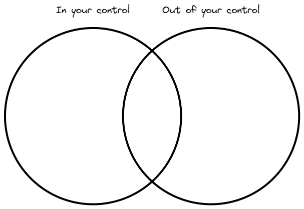

# Where to start when things pile up
## "It's cornflakes at work right now"
Currently I'm feeling the weight of many projects pile up. Between uni, work commitments, family projects (helping my sister prepare for a wedding) and much more, it's definitely a cornflake period (by that I mean full of crunches).

I'm often reminded of stoic philosophy when I feel like I have alot of things to do - that is you should only be concerned about those things you have some degree of control over, and most things are out of your control.
## The venn diagram of control
A way that can help illustrate what you do/don't have a say in is by listing out all the tasks, decisions and happenings in your life. These can then (in a very coarse-grained way) be separated into 'in your control', 'out of your control' and a bit of both.

  

To misquote Shakespeare, therein lies the rub; there are things that you both can and cannot control. This could be planning an event outside, where inclement weather can be known at best a little in advance.

  

## Stay at the helm
The main thing to know is that you always have a say with what you do *in this moment*. There are millions of moments, and they each fall neatly after the one that has just passed - so stay the course. Knowing that you are still at the helm is a powerful mentality.

  

